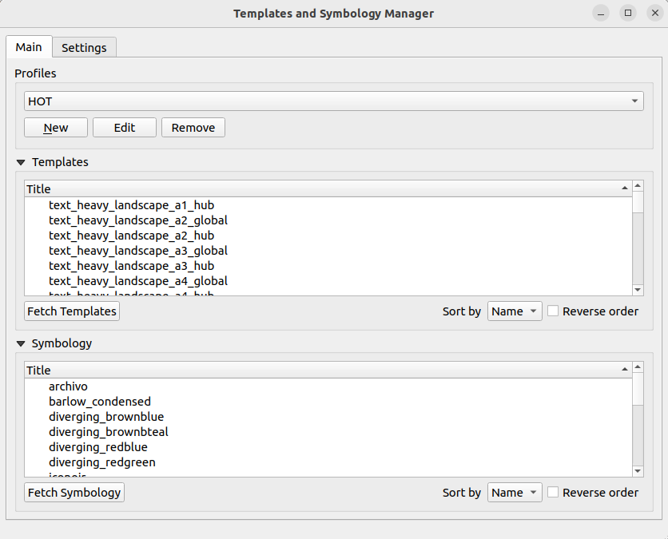
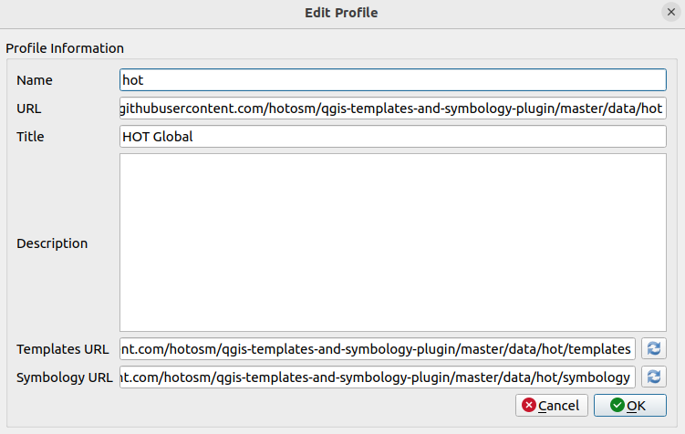

# QGIS Templates and Symbology plugin


QGIS plugin for managing map templates and symbology

### Installation

During the development phase the plugin is available to install via 
a dedicated plugin repository 
[https://raw.githubusercontent.com//hotosm/qgis-templates-and-symbology-plugin/release/docs/repository/plugins.xml](https://raw.githubusercontent.com//hotosm/qgis-templates-and-symbology-plugin/release/docs/repository/plugins.xml)

#### Install from QGIS plugin repository

- Open QGIS application and open plugin manager.
- Search for `Templates and Symbology Manager` in the All page of the plugin manager.
- From the found results, click on the `Templates and Symbology Manager` result item and a page with plugin information will show up. 
  
- Click the `Install Plugin` button at the bottom of the dialog to install the plugin.


#### Install from ZIP file

Alternatively the plugin can be installed using **Install from ZIP** option on the 
QGIS plugin manager. 

- Download zip file from the required plugin released version
https://github.com/hotosm/qgis-templates-and-symbology-plugin/releases/download/{tagname}/qgis_templates_symbology.{version}.zip

- From the **Install from ZIP** page, select the zip file and click the **Install** button to install plugin

#### Install from custom plugin repository

- Open the QGIS plugin manager, then select the **Settings** page

- Click **Add** button on the **Plugin Repositories** group box and use the above url to create
the new plugin repository.
- The plugin should now be available from the list
of all plugins that can be installed.

Disable QGIS official plugin repository in order to not fetch plugins from it.

**NOTE:** While the development phase is on going the plugin will be flagged as experimental, make
sure to enable the QGIS plugin manager in the **Settings** page to show the experimental plugins
in order to be able to install it.


When the development work is complete the plugin will be available on the QGIS
official plugin repository.


### Usage

The plugin can be used with the default profile that is available after install, users can also add new profiles that 
contain different templates and symbology files.

#### Default profile
The plugin default profile has templates and symbology designed for HOT related users, the plugin enables
- Download of profile templates and their corresponding projects.
- Loading of the layouts into the QGIS layout designer.
- Download of profile symbology into the filesystem.
- Fetching for the profile new resources.




#### Adding new profile

The plugin profile dialog allow creation of a new profile using a pre-defined format designed specifically to 
be used with this plugin.
The profile resources needs to be hosted as HTTP resources accessed via 
`profile_host/data/{profile_name}` eg. https://github.com/hotosm/qgis-templates-and-symbology-plugin/master/data/hot

Template resources should be under `profile_host/data/{profile_name}/templates` with a `data.json` file
inside `profile_host/data/{profile_name}/templates/data` endpoint, this json file should contain a list of all templates
for the profile. Example `data.json` file can be found here https://github.com/hotosm/qgis-templates-and-symbology-plugin/master/data/hot/templates/data/data.json

Same to the symbology resources they should be under `profile_host/data/{profile_name}/symbology` with a `data.json` file
inside `profile_host/data/{profile_name}/symbology/data` endpoint, and a json file should contain a list of all symbology and their properties
for the profile. Example `data.json` file can be found here https://github.com/hotosm/qgis-templates-and-symbology-plugin/master/data/hot/symbology/data/data.json

When creating a new profile the following details are needed.
- Name of the profile, used to identify the profile.
- URL of the profile, HTTP URL that will point to the profile resources.
- Title of the profile.
- Description about the profile resources.
- Templates URL, url used to locate the profile templates resources.
- Symbology URL, url used to locate the profile symbology.

Example profile dialog with details



### Development 

To use the plugin for development purposes, clone the repository locally,
install pip, a python dependencies management tool see https://pypi.org/project/pip/

#### Create virtual environment

Using any python virtual environment manager create project environment. 
Recommending to use [virtualenv-wrapper](https://virtualenvwrapper.readthedocs.io/en/latest/).

It can be installed using python pip 

```
pip install virtualenvwrapper
```

 1. Create virtual environment

    ```
    mkvirtualenv qgis_templates_symbology
    ```

2. Using the pip, install plugin development dependencies by running 

    ```
    pip install -r requirements-dev.txt
   ```


To install the plugin into the QGIS application, activate virtual environment and then use the below command

```
 python admin.py install
```
